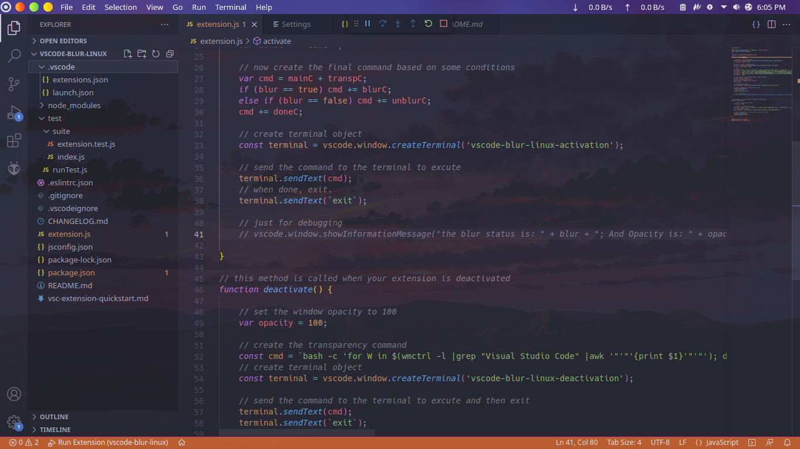
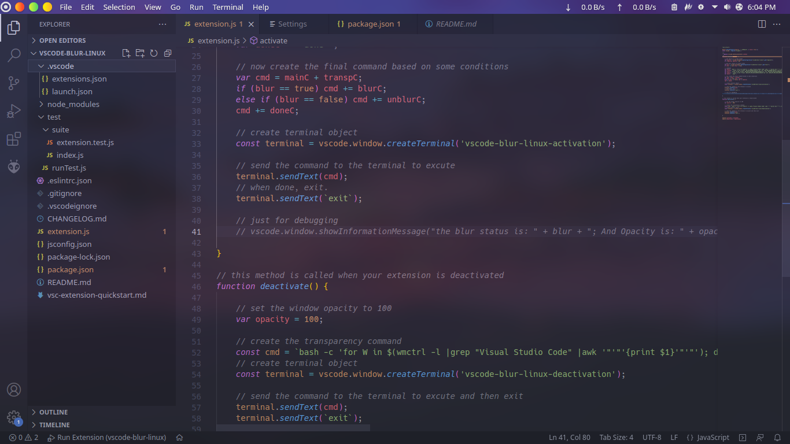
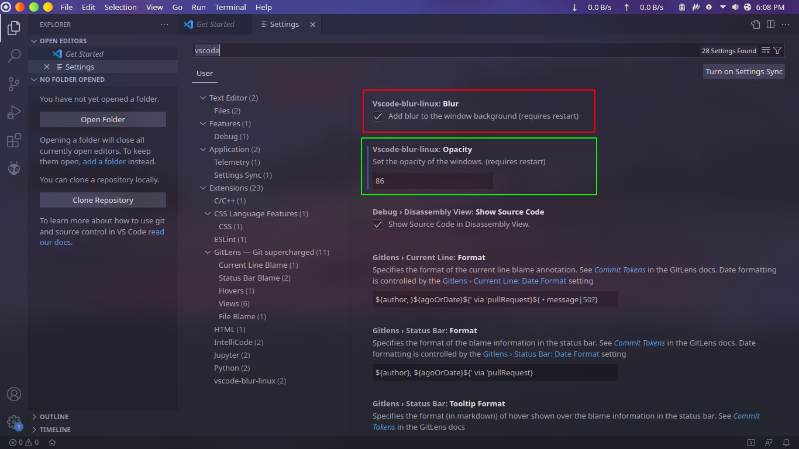

# vscode-blur-linux README

vscode-blur-linux helps to achieve transparent and blurry background to vscode window on linux.


## Features

This extension provides transparency and blurring features. Transparency effect is expected to be
working in all linux distros but the blur effect will only work in KDE Plasma distros for now. We
will add the support for blurring in GNOME distros soon.

### Make vscode window transparent


### Add blur effect to the vscode window (works on KDE Plasma Distros only)


### Activate or deactivate Blur and change Opacity in Settings


## Requirements

`vscode-blur-linux` requires `wmctrl` (to get the window ID), `xprop` (to set transparency), and `bash` (to run the transparency commands) installed on your system. These come standard with most Linux distributions, but just in case, you can install them with:

``` bash
sudo apt install -y wmctrl x11-utils bash
```

## Extension Settings

This extension contributes the following settings:

* `vscode-blur-linux.opacity`: opacity can be changed between 0-100 range, default is `88%`.
* `vscode-blur-linux.blur`: enable/disable blur effect behind the window.

## Usage

- Install the extension from marketplace.
- Restart the Visual Studio Code window.

